# Top 16 US Business Formation Platforms in 2025 (Recently Updated)

Starting a US business shouldn't feel like decoding tax law while filling out government paperwork at 2 AM. Whether you're launching an LLC from your apartment in Mumbai or incorporating a C-corp from a coffee shop in Austin, the right business formation platform handles the paperwork jungle while you focus on building something people actually want. This list covers services that get you legally set up faster, manage ongoing compliance without constant reminders, and cost less than hiring a lawyer to explain what an EIN is.

---

## **[doola](https://www.doola.com)**

All-in-one platform that handles US business formation, bookkeeping, tax filings, and e-commerce analytics from a single dashboard without switching between five different service providers.

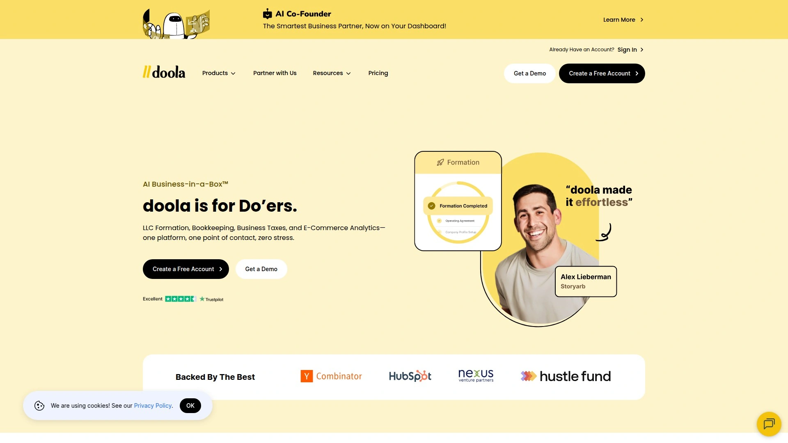

doola works particularly well for non-US residents who want to form American companies remotely. The platform manages LLC and C-corp formation across multiple states, obtains your EIN without requiring a US address, and provides registered agent services in all 50 states. After formation, you get dedicated bookkeeper support instead of generic software tutorials, annual state tax filing services that prevent missed deadlines, and IRS business tax filing that removes the guesswork from federal compliance.

**What makes it different:** The e-commerce analytics module tracks Shopify and Amazon transactions alongside your financial books, so you see real campaign performance and profit margins in one place rather than comparing spreadsheets. doola includes free CPA consultation when tax season arrives, and the platform's white-label solutions let accounting firms offer formation services under their own branding.

The pricing starts higher than bare-bones formation services, but you're paying for integrated bookkeeping, tax prep, and compliance monitoring rather than just incorporation paperwork. For founders who want someone else to handle the operational tax headaches while they focus on product development, doola consolidates what would otherwise require three separate subscriptions.

***

## **[ZenBusiness](https://www.zenbusiness.com)**

Popular choice for first-time business owners who need affordable LLC formation with compliance reminders and ongoing support without complicated package tiers.

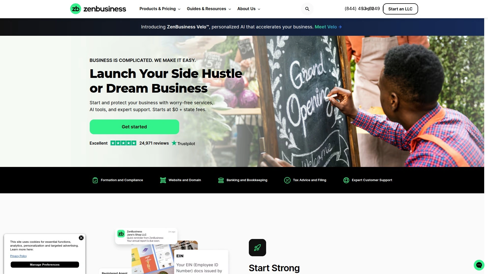

ZenBusiness offers formation starting at $0 plus state fees, though their real value sits in the mid-tier packages that include worry-free compliance service where they file your annual reports automatically. You get registered agent service for $199 annually, though existing customers can opt for standard coverage at lower rates if they already have compliance tools. The platform includes website building tools, logo creation, and domain registration for founders who need marketing assets alongside legal formation.

Their Velo AI assistant helps answer formation questions without waiting on hold for customer support, though phone and email help remains available seven days a week. Processing typically takes 7-14 business days depending on state filing speeds, making them middle-of-the-pack for turnaround times compared to expedited services.

ZenBusiness works best for budget-conscious entrepreneurs who want a full-featured platform with moderate pricing rather than either the cheapest bare-minimum option or premium concierge service. Over 700,000 businesses have used their services, indicating decent reliability for standard formation needs.

***

## **[Northwest Registered Agent](https://www.northwestregisteredagent.com)**

Privacy-focused formation service that keeps your home address off public records and charges transparent pricing without subscription upsells or surprise renewal fees.

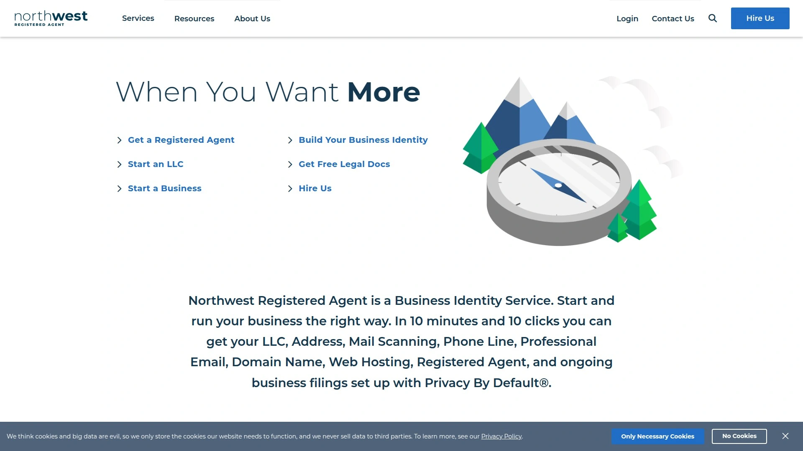

**Core strength: privacy protection.** Northwest lets you use their business address on all state filings at no extra cost, reducing spam mail and keeping your home location out of online databases that scrape public business records. This matters for home-based businesses where the alternative is publishing your residential address on secretary of state websites.

Formation pricing starts at $39 plus state fees with the first year of registered agent service included free, then $125 annually after that. They don't bundle website builders, logo design, or business banking services—you're paying strictly for formation and compliance tools. Customer service runs through phone and email rather than chatbots, with responses typically within business hours from people who actually understand state filing requirements.

The service works particularly well for founders on tight budgets who prioritize privacy and straightforward pricing over bundled marketing tools. Their dashboard provides scanned mail forwarding and document storage, though it lacks the invoicing or bookkeeping features found in more comprehensive platforms.

***

## **[Firstbase](https://www.firstbase.io)**

Startup-focused platform offering formation in 34 states with fast EIN retrieval, banking setup without tax ID requirements, and $350,000 in partner deals for software tools.

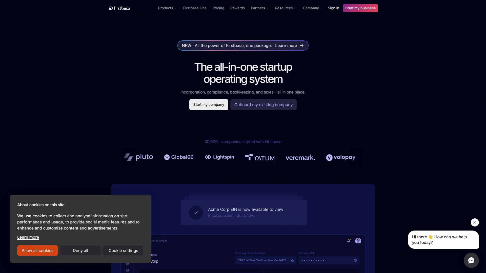

Firstbase charges $399 for formation and includes expedited EIN processing, lifetime expert support, and access to their partner network of discounted SaaS products. The platform allows bank account opening through Mercury before your EIN arrives, solving a common bottleneck for international founders who face 4-6 week IRS processing times. Annual compliance and registered agent service costs $99 per year after formation.

**Formation flexibility:** You can incorporate in Delaware, Wyoming, or 32 other states depending on where your business operates physically. This beats services locked into Delaware-only formation, though most small businesses should still incorporate where they physically work to avoid foreign qualification fees.

Their Firstbase Discovery program connects early-stage startups with venture capital networks, though this feature matters more for tech companies raising institutional funding than service businesses bootstrapping revenue. Free tax consultation comes included, and the platform provides ongoing compliance alerts for state filing deadlines.

***

## **[Stripe Atlas](https://stripe.com/atlas)**

Delaware C-corp formation designed for technology startups raising venture capital, with 83(b) election filing, stock issuance templates, and integrated Stripe payment processing.

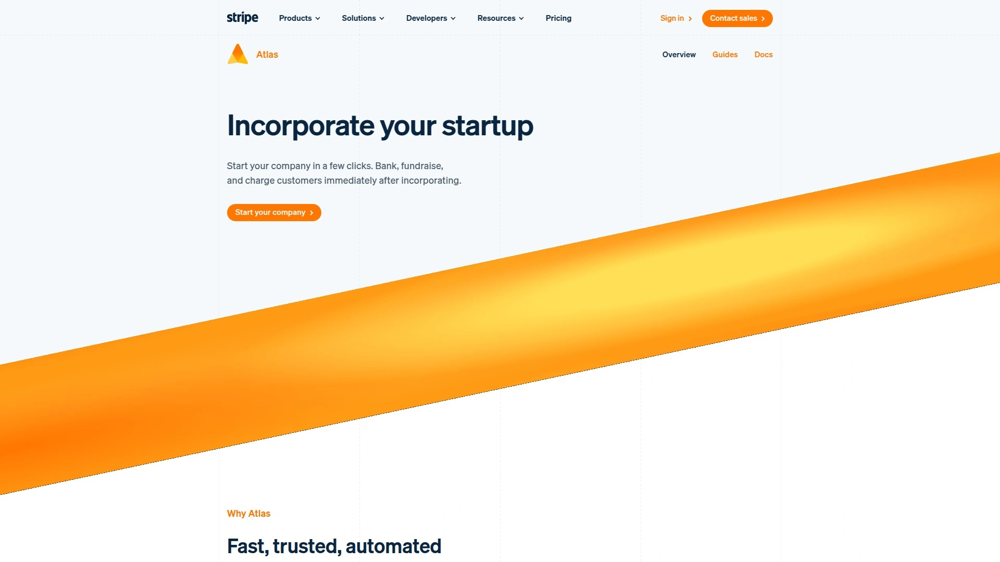

Stripe Atlas costs $500 upfront and includes Delaware incorporation, first-year registered agent service ($100 annually after), founder stock issuance with proper vesting terms, and 83(b) tax election filing. The formation documents come from Goodwin Procter, a law firm specializing in startup legal structures, meaning term sheets match what investors expect to see.

**Best fit: venture-backed tech companies.** The service optimizes for startups planning to raise SAFE notes or priced equity rounds rather than profitable service businesses or ecommerce stores. Integration with Stripe means payment processing connects directly to your incorporation paperwork, though you'll still need separate bookkeeping and tax filing services.

Formation completes within 3-5 business days for standard processing. Atlas exclusively forms Delaware C-corps, so if you want an LLC or need formation in another state, other services provide more flexibility. The platform includes access to Stripe Atlas community and founder resources, though operational support focuses on early-stage financing rather than ongoing compliance or bookkeeping.

***

## **[LegalZoom](https://www.legalzoom.com)**

Established brand providing LLC and corporation formation alongside trademark registration, legal document templates, and attorney consultation for ongoing business legal needs.

LegalZoom sits at the premium end of formation pricing but includes attorney access for legal questions beyond basic incorporation. Their registered agent service costs $249 per year, higher than competitors charging $125-$150 for the same mail forwarding and compliance notifications. Formation packages include operating agreements, EIN filing, and compliance tracking, with turnaround times varying by state processing speeds.

**Where they excel:** legal document creation beyond formation. You can add trademark searches and registration, contract templates, and ongoing legal plan subscriptions that provide attorney consultations when contract or employment issues arise. This matters more for businesses needing regular legal guidance than founders who just need formation paperwork filed correctly.

Brand recognition helps if you prefer working with well-known companies over newer specialized services, though the premium pricing doesn't always translate to faster processing or better customer support compared to budget-focused competitors. Best for founders who value attorney access and anticipate needing legal document help beyond incorporation.

***

## **[Harbor Compliance](https://www.harborcompliance.com)**

Premium formation service providing dedicated personal account managers rather than general customer support lines, with faster processing and white-glove onboarding.

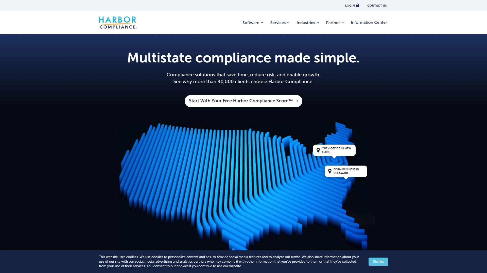

Harbor Compliance charges $399 for their formation package and $799 for their all-inclusive compliance bundle. What you're buying is personalized support—you get an assigned account manager who handles your specific questions rather than calling a rotating support team. Formation includes operating agreement templates, EIN filing, and one year of registered agent service.

Processing times run faster than budget services because Harbor prioritizes expedited state filing options. Their compliance package monitors ongoing state requirements and files annual reports on your behalf, reducing the administrative burden of tracking deadlines across different states.

**Best for:** founders with budget flexibility who want personalized guidance through formation and first-year compliance. If you're comfortable with self-service platforms and generic support, cheaper options provide similar formation outcomes. But for complex situations—multi-state businesses, foreign qualification, or specific industry requirements—the dedicated account manager justifies the premium.

***

## **[Bizee](https://www.bizee.com)**

Formerly Incfile, offering free LLC formation packages where you pay only state filing fees, with upgrade options for faster processing and additional compliance services.

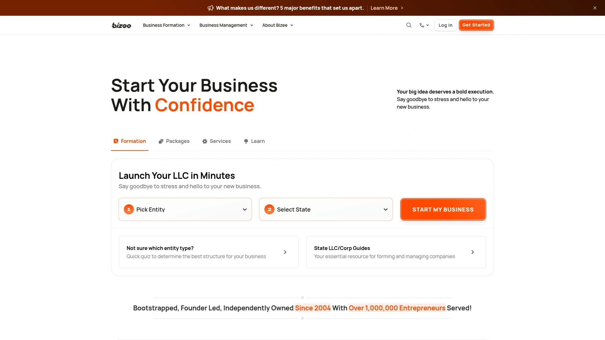

Bizee's free formation package includes preparation and filing of articles of organization, unlimited name searches, and online access to formation documents. You're paying $0 service fee plus whatever your state charges for LLC filing (typically $50-$500 depending on jurisdiction). First-year registered agent service comes free, renewing at standard rates after 12 months.

**Processing speed:** standard filing takes 30-40 business days on average. For faster turnaround, paid packages offer same-day processing options, though you're then paying $299+ which removes the free formation advantage. The platform includes basic compliance tools and state filing alerts, though more advanced bookkeeping or tax services require separate subscriptions.

Bizee works well for bootstrapped founders who want legitimate formation without upfront service fees, understanding that free means slower processing and fewer included features than premium competitors. Customer support quality varies based on support ticket volume, though phone assistance remains available during business hours.

***

## **[CorpNet](https://www.corpnet.com)**

Comprehensive formation platform trusted by accountants and legal professionals, offering business filings in all 50 states with API integration for firms managing multiple client formations.

CorpNet provides basic formation starting around $99 plus state fees, deluxe packages with EIN filing and first-year registered agent service, and complete packages including certified copies and compliance tools. They form LLCs, C-corps, S-corps, nonprofits, and professional corporations, covering entity types beyond the LLC/C-corp focus of startup-oriented platforms.

**Why accountants use it:** the API and white-label options let professional service firms offer formation under their own branding without building internal filing infrastructure. For individual founders, CorpNet delivers reliable filing with strong compliance tracking and deadline reminders across all states.

Formation processing typically completes within 5-10 business days depending on state requirements. The platform provides registered agent service in all 50 states, automated compliance alerts, and access to every state form a business might need for ongoing filings. Customer support runs through phone and email with trained specialists rather than automated systems.

***

## **[Tailor Brands](https://www.tailorbrands.com)**

Formation service bundled with website design, logo creation, and social media templates for founders who need complete brand identity alongside legal incorporation.

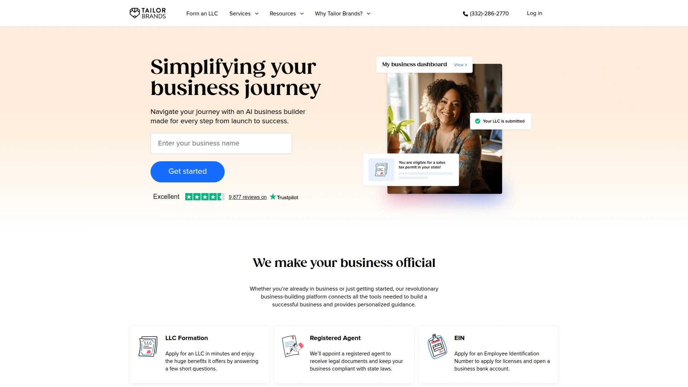

Tailor Brands charges premium pricing but includes AI-powered logo design, custom website templates, business card design, and social media asset creation. Formation packages cover standard LLC and corporation filings with registered agent service, while the real differentiation comes from marketing asset generation.

**Best use case:** founders starting consumer brands or service businesses where visual identity matters from day one. If you're building B2B software or consulting services where brand assets aren't immediate priorities, paying extra for bundled design tools doesn't provide value.

The website builder includes ecommerce functionality and SEO optimization tools, though platforms like Shopify or Webflow provide more robust ecommerce features if that's your primary business model. Formation processing runs standard timelines of 7-14 days depending on state speeds. Customer support covers both legal formation questions and design assistance through their platform.

***

## **[Rocket Lawyer](https://www.rocketlawyer.com)**

Legal subscription platform offering LLC formation alongside ongoing document creation, contract templates, and attorney consultations for businesses needing regular legal support.

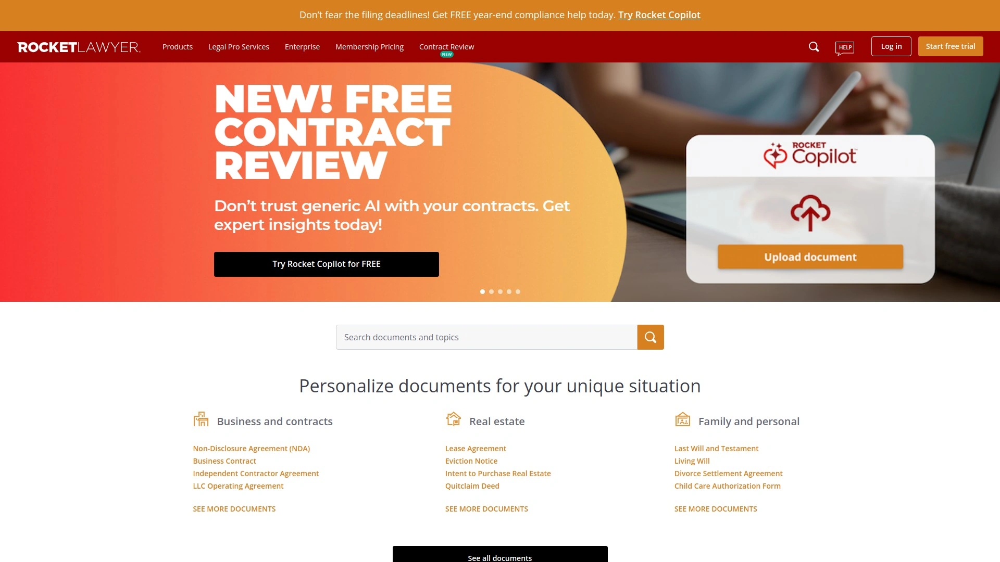

Rocket Lawyer structures pricing as membership subscriptions rather than one-time formation fees. Monthly membership includes formation services, unlimited legal document creation from their template library, contract reviews, and 30-minute attorney consultations. For businesses needing regular contract work, lease agreements, or employment documents, the subscription model costs less than paying for individual attorney consultations.

Formation itself follows standard processes—filing articles of organization, obtaining EIN, setting up registered agent service. The advantage comes from bundled legal document access after formation completes. You can generate customized operating agreements, partnership agreements, contractor agreements, and rental agreements without additional per-document fees.

**When it makes sense:** businesses anticipating regular legal document needs. If you only need formation and don't foresee ongoing contract work, paying monthly subscription fees costs more than one-time formation services. Customer support includes both technical platform help and attorney guidance depending on your question.

***

## **[Swyft Filings](https://www.swyftfilings.com)**

Fast-processing formation service living up to its name with expedited state filing options and same-business-day submission for founders who need quick incorporation.

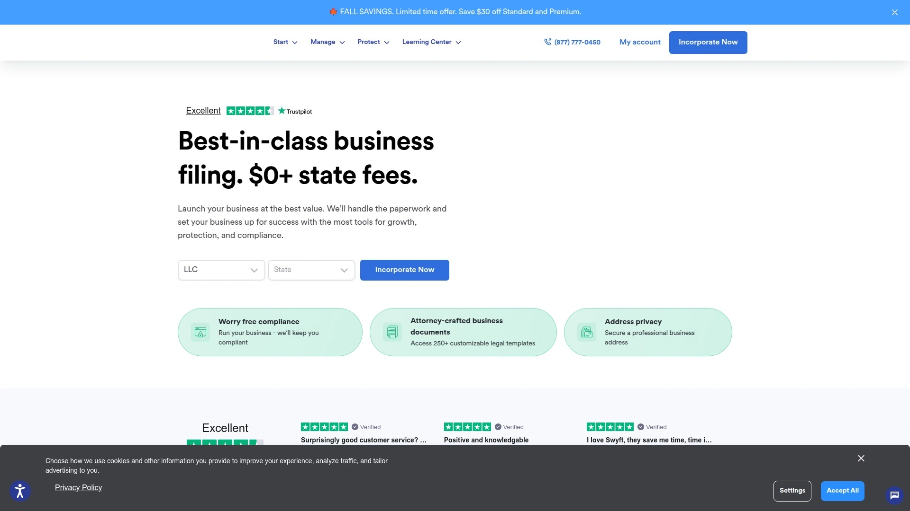

Swyft Filings emphasizes speed—their standard processing submits paperwork to the state same business day you complete your order. Actual approval times depend on state processing speeds, but eliminating internal processing delays means your formation completes faster than services batching submissions. Pricing starts around $49 plus state fees for basic formation, with registered agent service and compliance monitoring available as add-ons.

**Formation coverage:** all 50 states for LLCs and corporations. The platform includes unlimited name availability searches before you commit to your business name, reducing the risk of rejection after paying filing fees. Operating agreements and EIN filing come included in mid-tier packages.

Customer support runs through phone, email, and live chat during business hours. The service works well for founders who've already researched entity types and state selection, understanding what they need without extensive guidance—you're paying for fast execution rather than consultation. For founders needing more hand-holding through entity selection or state choice, services with dedicated account managers provide better support.

***

## **[BetterLegal](https://www.betterlegal.com)**

Single-package formation service charging $299 flat rate with registered agent service, EIN filing, and high customer satisfaction ratings without complicated tier selection.

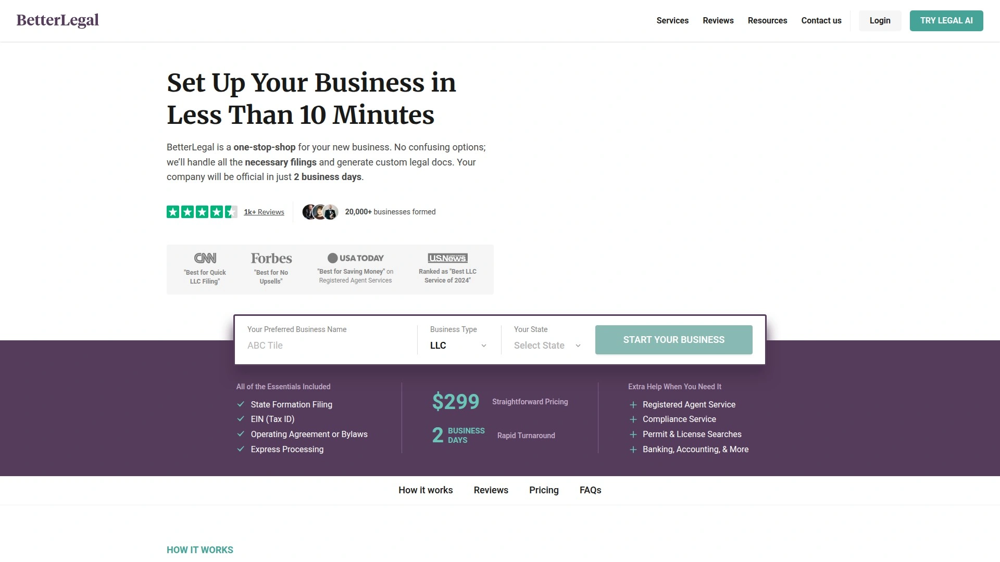

BetterLegal simplifies decision-making by offering one package price rather than comparing basic, standard, and premium options. Their $299 fee plus state filing costs includes everything most businesses need—formation filing, first year registered agent service, EIN application, operating agreement, and compliance calendar. No upsells or subscription renewals to manage beyond annual registered agent fees.

Customer satisfaction scores consistently high, likely because single-package pricing removes confusion about what you're getting versus what costs extra. Processing follows standard timelines of 7-15 business days depending on state workload. Support comes through email and phone rather than chat, with responses typically same business day.

**When to choose BetterLegal:** you want straightforward pricing without comparing feature matrices. The $299 price point sits mid-market—not the cheapest option but includes features that would be add-ons at budget providers. Their registered agent services cost less than LegalZoom's $249 annual fee while providing the same mail forwarding and compliance notifications.

***

## **[Inc Authority](https://www.incauthority.com)**

Free LLC formation platform similar to Bizee, where you pay only state filing fees with the understanding that processing takes longer than expedited services.

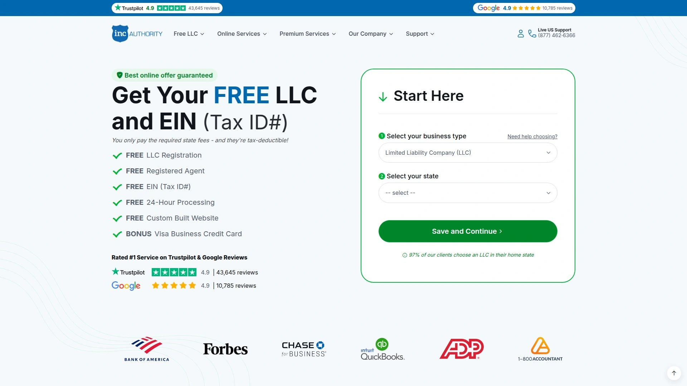

Inc Authority's free package covers business name search, articles of organization preparation, and filing with your secretary of state. First-year registered agent service comes included, converting to paid renewal after 12 months at standard rates. Processing averages 30-40 business days for standard free formation, significantly slower than premium services offering 3-5 day turnaround.

Additional services like EIN filing, certified copies, and operating agreements are available as paid add-ons. Website building tools and business branding services integrate with the platform if you want marketing assets beyond legal formation. Customer support quality receives mixed reviews—helpful when you reach representatives, but phone wait times can run long during peak filing seasons.

**Best for:** founders with flexible timing who prioritize saving upfront costs over fast processing. The free formation works well if you're handling other business setup tasks during the 30-40 day state processing window, making the wait time less critical. For time-sensitive launches or situations requiring fast bank account opening, paid services justify their costs.

---

## **[MyCompanyWorks](https://www.mycompanyworks.com)**

Same-day processing specialist offering rush formation services with guaranteed 24-hour business day submission for founders needing immediate incorporation.

MyCompanyWorks charges $149-299 depending on package level, with same-business-day processing included in all tiers. Their guarantee means paperwork goes to the state within hours of completing your order, though actual approval still depends on state processing speeds which vary from 1-14 days. Formation packages include personalized operating agreement, organizational minutes, banking resolution, and EIN filing.

**Lifetime platform access:** you get permanent access to their dashboard for document storage, form templates, and compliance tracking rather than subscription-based access that expires. This matters for businesses wanting long-term document archives without ongoing platform fees. The Startup Wizard walks through post-formation tasks like bank account opening, licensing, and tax registrations.

Support runs through unlimited phone and email during business hours with 100% satisfaction guarantee. The service works particularly well for founders who need fast formation and value permanent platform access over first-year free registered agent promotions. Virtual address services available as add-on for using business address on formation documents.

***

## **[AngelList Stack](https://www.angellist.com)**

Startup operating system combining incorporation through Stripe Atlas partnership with cap table management, fundraising tools, and investor relationship management for venture-backed companies.

AngelList partners with Stripe Atlas for the actual incorporation process, meaning you get Delaware C-corp formation with the same $500 fee structure and investor-friendly terms. What separates AngelList is the integrated platform for post-incorporation operations—cap table management automatically updates when SAFE investors send funds, roll-up vehicles keep investor counts manageable, and equity grants track employee stock options.

**Startup-specific advantages:** 83(b) election filing happens automatically, founders preferred stock includes extended exercise windows for employees, and legal templates come from startup-focused law firms. The platform connects fundraising directly to cap table updates, reducing manual data entry when raising seed rounds.

Formation completes within 1-3 business days through the Stripe Atlas partnership. First year subscription to AngelList's Starter plan included free, providing access to equity tools, Delaware registered agent service, and legal templates. For founders building traditional small businesses without venture funding plans, the platform provides more complexity than necessary. But for tech startups raising institutional capital, AngelList consolidates tools that would otherwise require separate subscriptions for incorporation, cap table software, and fundraising document generation.

***

## **[BizFilings](https://www.wolterskluwer.com/en/solutions/bizfilings)**

Wolters Kluwer business formation platform serving over 500,000 customers, offering affordable incorporation with emphasis on compliance management and corporate record keeping.

BizFilings provides formation services alongside comprehensive compliance tools that track annual report deadlines, franchise tax due dates, and state-specific filing requirements. Formation packages include standard features like articles of organization filing, EIN application, and registered agent service, with pricing competitive to mid-market providers. The platform handles LLCs and corporations across all states, including foreign qualification for businesses operating across state lines.

**Corporate compliance focus:** the platform excels at tracking ongoing requirements after formation completes. Automated reminders for annual reports, beneficial ownership reporting, and state tax registrations prevent missed deadlines that trigger late fees or administrative dissolution. Document storage keeps formation certificates, operating agreements, and amendment filings organized in searchable archives.

Processing speed follows industry standards of 7-14 business days depending on state workload. Customer support includes both online resources and phone assistance during business hours. The service works particularly well for businesses prioritizing long-term compliance management over cheapest possible formation costs, though pricing remains affordable compared to premium concierge services.

***

## FAQ

### How long does business formation actually take from start to finish?

Most formation services submit your paperwork within 1-3 business days, but state approval times vary dramatically. Delaware processes corporations in 24 hours with expedited filing, while California LLC approvals run 15-20 business days during busy periods. After state approval, EIN processing adds 1-2 weeks if filing by mail or same-day through IRS online systems. Budget 3-6 weeks total from first payment to having all documents ready for bank account opening, unless you pay for expedited processing that cuts timelines to 5-7 days.

### Should I incorporate in Delaware or my home state?

Form in your home state if you're running a small business, freelancing, or building a local service company—it's cheaper and simpler. Delaware makes sense primarily for venture-backed startups raising institutional money, since investors expect Delaware C-corps with standard corporate structures. If you incorporate in Delaware but operate physically in Texas, you'll pay Delaware formation fees, Delaware annual franchise tax, Delaware registered agent fees, plus Texas foreign qualification fees and Texas franchise tax—doubling your compliance costs without meaningful benefit.

### What's the real cost difference between DIY formation and using a service?

DIY formation costs only state filing fees ($50-$500 depending on state) but requires researching filing requirements, drafting operating agreements, applying for EIN separately, and finding a registered agent. Formation services charge $0-$500 service fees plus state costs, handling paperwork preparation, registered agent service, EIN filing, and compliance tracking. The time savings matters more than money for most founders—spending 8-12 hours researching filing procedures saves maybe $200, while that time spent on customer development or product building generates significantly more business value.

***

## Conclusion

Each formation service optimizes for different priorities—some focus on speed, others on privacy, several on bundled bookkeeping or ongoing compliance. **[doola](https://www.doola.com)** works particularly well for international founders and ecommerce businesses needing formation, bookkeeping, and tax filing consolidated into one platform instead of coordinating between three separate subscriptions. The integrated approach removes the common problem of tracking which service handles which deadline, especially valuable when you're focused on growing revenue rather than managing administrative vendors.
